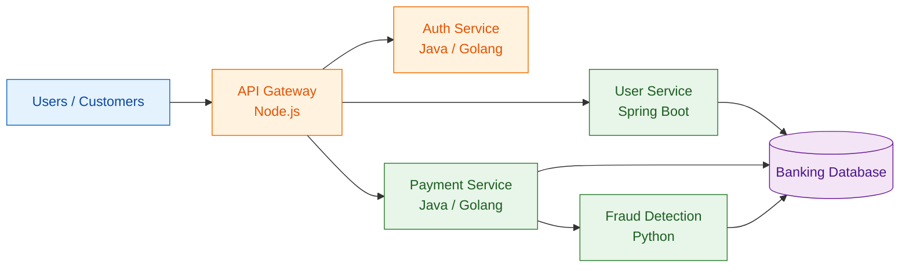
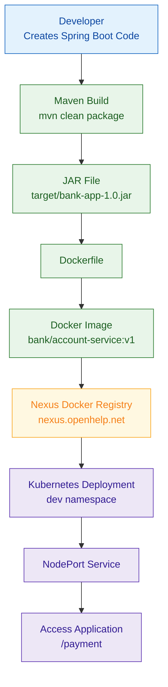
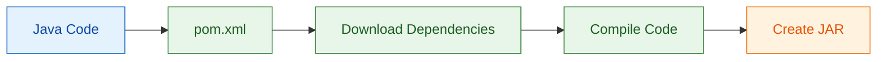
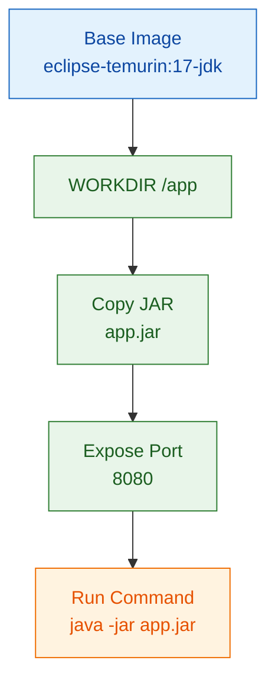
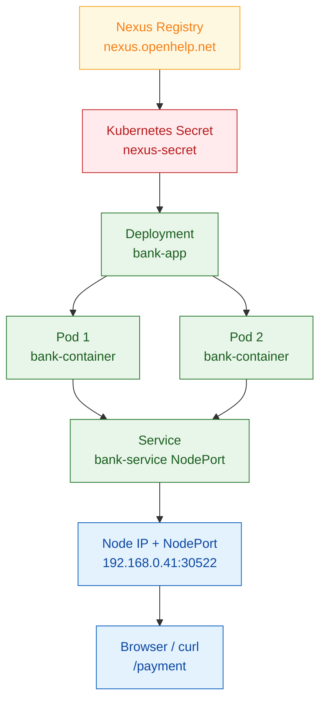

# End-to-End Manual Deployment of a Spring Boot Banking Application Without CI/CD Pipeline

This document explains how to manually build, containerize, push, and deploy a Spring Boot application to Kubernetes without using a CI/CD pipeline.

> **Note:** This guide keeps the same manual flow used in the original steps. Real passwords are replaced with placeholders such as `<NEXUS_PASSWORD>` for safety. Replace them with your actual lab credentials only when executing commands.

---

## 1. Typical Banking / Insurance Microservices Architecture

In a banking or insurance domain, applications are commonly split into multiple microservices. Each team may own one service and use different technologies.

| Microservice | Example Technology |
|---|---|
| User Service | Java / Spring Boot |
| Payment Service | Java / Golang |
| Fraud Detection | Python |
| API Gateway | Node.js |
| Auth Service | Java / Golang |



---

## 2. Manual Deployment Flow Without CI/CD



---

## 3. Developer Creates the Spring Boot Project

The developer from the `user_service` or `payment_service` department creates the application project.

### 3.1 Create Project Directory

```bash
root@ci:~# mkdir -p /root/bank-app/
root@ci:~# cd /root/bank-app/
root@ci:~/bank-app# mkdir -p src/main/java/com/bank
```

### Sample Output

```text
No output means the directories were created successfully.
```

---

## 4. Create the Spring Boot Application Code

Create the Java application file.

```bash
root@ci:~/bank-app# vi src/main/java/com/bank/App.java
```

Add the following code:

```java
package com.bank;

import org.springframework.boot.*;
import org.springframework.boot.autoconfigure.*;
import org.springframework.web.bind.annotation.*;

@SpringBootApplication
@RestController
public class App {

    @GetMapping("/payment")
    public String hello() {
        return "Bank Payment Service Running Successfully!";
    }

    public static void main(String[] args) {
        SpringApplication.run(App.class, args);
    }
}
```

### Explanation

This application exposes one REST endpoint:

```text
/payment
```

When this endpoint is called, the application returns:

```text
Bank Payment Service Running Successfully!
```

---

## 5. Create the Maven `pom.xml` File

First confirm the project path.

```bash
root@ci:~/bank-app# pwd
/root/bank-app
```

Create the Maven configuration file.

```bash
root@ci:~/bank-app# vi pom.xml
```

Add the following content:

```xml
<project xmlns="http://maven.apache.org/POM/4.0.0">
  <modelVersion>4.0.0</modelVersion>

  <groupId>com.bank</groupId>
  <artifactId>bank-app</artifactId>
  <version>1.0</version>

  <parent>
    <groupId>org.springframework.boot</groupId>
    <artifactId>spring-boot-starter-parent</artifactId>
    <version>3.2.0</version>
  </parent>

  <dependencies>
    <dependency>
      <groupId>org.springframework.boot</groupId>
      <artifactId>spring-boot-starter-web</artifactId>
    </dependency>
  </dependencies>

  <build>
    <plugins>
      <plugin>
        <groupId>org.springframework.boot</groupId>
        <artifactId>spring-boot-maven-plugin</artifactId>
      </plugin>
    </plugins>
  </build>
</project>
```

---

## 6. Why We Use `pom.xml`

### 6.1 Manage Dependencies

Your Java code uses Spring Boot libraries:

```java
import org.springframework.boot.*;
import org.springframework.web.bind.annotation.*;
```

These libraries do not come with plain Java. Maven reads the `pom.xml` file and downloads the required libraries.

Example dependency:

```xml
<dependency>
  <groupId>org.springframework.boot</groupId>
  <artifactId>spring-boot-starter-web</artifactId>
</dependency>
```

Maven automatically downloads:

- Spring Boot libraries
- Embedded Tomcat server
- Web libraries
- Required transitive dependencies



---

## 7. Build the Project

Run the Maven build command.

```bash
root@ci:~/bank-app# mvn clean package
```

### What This Command Does

```text
Java Code
   ↓
Maven reads pom.xml
   ↓
Downloads dependencies
   ↓
Compiles code
   ↓
Runs tests
   ↓
Creates JAR file
```

### Expected Build Output

```text
[INFO] Scanning for projects...
[INFO]
[INFO] -------------------------< com.bank:bank-app >-------------------------
[INFO] Building bank-app 1.0
[INFO] --------------------------------[ jar ]---------------------------------
[INFO]
[INFO] --- maven-clean-plugin:3.3.2:clean (default-clean) @ bank-app ---
[INFO] --- maven-resources-plugin:3.3.1:resources (default-resources) @ bank-app ---
[INFO] --- maven-compiler-plugin:3.11.0:compile (default-compile) @ bank-app ---
[INFO] --- maven-surefire-plugin:3.1.2:test (default-test) @ bank-app ---
[INFO] --- spring-boot-maven-plugin:3.2.0:repackage (repackage) @ bank-app ---
[INFO] Replacing main artifact /root/bank-app/target/bank-app-1.0.jar
[INFO] BUILD SUCCESS
```

Check the generated JAR file.

```bash
root@ci:~/bank-app# ls -lh target/bank-app-1.0.jar
```

### Sample Output

```text
-rw-r--r-- 1 root root 18M Apr 12 12:00 target/bank-app-1.0.jar
```

---

## 8. Run the JAR File Locally

Run the Spring Boot JAR file.

```bash
root@ci:~/bank-app# java -jar target/bank-app-1.0.jar
```

### Sample Output

```text
  .   ____          _            __ _ _
 /\\ / ___'_ __ _ _(_)_ __  __ _ \ \ \ \
( ( )\___ | '_ | '_| | '_ \/ _` | \ \ \ \
 \\/  ___)| |_)| | | | | || (_| |  ) ) ) )
  '  |____| .__|_| |_|_| |_\__, | / / / /
 =========|_|==============|___/=/_/_/_/
 :: Spring Boot ::                (v3.2.0)

2026-04-12T12:01:23.986Z  INFO 114295 --- [           main] com.bank.App                             : Starting App v1.0 using Java 17.0.18 with PID 114295 (/root/bank-app/target/bank-app-1.0.jar started by root in /root/bank-app)
2026-04-12T12:01:23.995Z  INFO 114295 --- [           main] com.bank.App                             : No active profile set, falling back to 1 default profile: "default"
2026-04-12T12:01:26.727Z  INFO 114295 --- [           main] o.s.b.w.embedded.tomcat.TomcatWebServer  : Tomcat initialized with port 8080 (http)
2026-04-12T12:01:26.772Z  INFO 114295 --- [           main] o.apache.catalina.core.StandardService   : Starting service [Tomcat]
2026-04-12T12:01:26.773Z  INFO 114295 --- [           main] o.apache.catalina.core.StandardEngine    : Starting Servlet engine: [Apache Tomcat/10.1.16]
2026-04-12T12:01:26.887Z  INFO 114295 --- [           main] o.a.c.c.C.[Tomcat].[localhost].[/]       : Initializing Spring embedded WebApplicationContext
2026-04-12T12:01:26.890Z  INFO 114295 --- [           main] w.s.c.ServletWebServerApplicationContext : Root WebApplicationContext: initialization completed in 2656 ms
2026-04-12T12:01:28.019Z  INFO 114295 --- [           main] o.s.b.w.embedded.tomcat.TomcatWebServer  : Tomcat started on port 8080 (http) with context path ''
```

The Spring Boot application starts an embedded Tomcat server on port `8080`.

---

## 9. Test the Application from Another Terminal

Open another terminal on the same `ci` host and run:

```bash
root@ci:~# curl http://localhost:8080/payment
```

### Sample Output

```text
Bank Payment Service Running Successfully!
```

---

## 10. Application Team Responsibility

The application team usually performs these tasks:

- Writes application code
- Builds the JAR using `mvn clean package`
- Creates the Dockerfile using `vi`, VS Code, or another editor

In a real company, the JAR build may also be done by Jenkins or another CI/CD tool.

---

## 11. Create the Dockerfile

Create the Dockerfile inside the application directory.

```bash
root@ci:~/bank-app# vi Dockerfile
```

Add the following content:

```dockerfile
FROM eclipse-temurin:17-jdk

WORKDIR /app

COPY target/bank-app-1.0.jar app.jar

EXPOSE 8080

CMD ["java", "-jar", "app.jar"]
```

### Dockerfile Explanation

| Dockerfile Line | Explanation |
|---|---|
| `FROM eclipse-temurin:17-jdk` | Uses a Docker image with Linux and Java 17 JDK installed |
| `WORKDIR /app` | Sets `/app` as the working directory inside the container |
| `COPY target/bank-app-1.0.jar app.jar` | Copies the Spring Boot JAR into the image |
| `EXPOSE 8080` | Documents that the container listens on port `8080` |
| `CMD ["java", "-jar", "app.jar"]` | Starts the Spring Boot application |



---

## 12. DevOps Team Responsibility

The DevOps or platform engineer usually performs these tasks:

- Creates Docker images manually or through CI/CD
- Pushes images to a registry such as Nexus
- Creates Kubernetes YAML files
- Deploys applications to Kubernetes manually or through CI/CD
- Configures RBAC, kubeconfig, secrets, and deployment automation

For this guide, the deployment is done manually for learning purpose.

---

## 13. Build the Docker Image

Run the following command from the directory where the Dockerfile exists.

```bash
root@ci:~/bank-app# docker build -t bank/account-service:v1 .
```

### What This Command Does

| Part | Explanation |
|---|---|
| `docker build` | Builds a Docker image |
| `-t bank/account-service:v1` | Tags the image with name and version |
| `.` | Uses the current directory as Docker build context |

### Expected Result

```text
A Docker image is created locally with this name:

bank/account-service:v1
```

### Sample Output

```text
[+] Building 6.8s (8/8) FINISHED
 => [internal] load build definition from Dockerfile
 => [internal] load metadata for docker.io/library/eclipse-temurin:17-jdk
 => [internal] load .dockerignore
 => [1/3] FROM docker.io/library/eclipse-temurin:17-jdk
 => [2/3] WORKDIR /app
 => [3/3] COPY target/bank-app-1.0.jar app.jar
 => exporting to image
 => naming to docker.io/bank/account-service:v1
```

---

## 14. List Docker Images

```bash
root@ci:~/bank-app# docker image ls
```

### Sample Output

```text
REPOSITORY             TAG       IMAGE ID       CREATED          SIZE
bank/account-service   v1        bea68370d999   10 seconds ago   673MB
```

---

## 15. Run the Docker Container Locally

```bash
root@ci:~/bank-app# docker run -d -p 8080:8080 bank/account-service:v1
```

### What This Command Does

| Part | Explanation |
|---|---|
| `docker run` | Starts a container |
| `-d` | Runs the container in detached/background mode |
| `-p 8080:8080` | Maps host port `8080` to container port `8080` |
| `bank/account-service:v1` | Image used to start the container |

### Sample Output

```text
f4f5c1da7428689b91d88a0fa149c623348df00bd8c488bb3a5fcf11a177
```

---

## 16. Check Running Containers

```bash
root@ci:~/bank-app# docker ps
```

### Sample Output

```text
CONTAINER ID   IMAGE                     COMMAND                  CREATED          STATUS          PORTS                    NAMES
f4f5c1da7428   bank/account-service:v1   "java -jar app.jar"      20 seconds ago   Up 19 seconds   0.0.0.0:8080->8080/tcp   bank-app
```

---

## 17. Test the Docker Container

Open another console on the same `ci` host.

```bash
root@ci:~# curl http://localhost:8080/payment
```

### Sample Output

```text
Bank Payment Service Running Successfully!
```

This confirms that the Spring Boot application is running inside Docker.

---

## 18. Login to Nexus Docker Registry

Logout from Nexus first.

```bash
root@ci:~# docker logout nexus.openhelp.net
```

### Sample Output

```text
Removing login credentials for nexus.openhelp.net
```

Login to Nexus.

```bash
root@ci:~# docker login nexus.openhelp.net
Username: admin
Password: <NEXUS_PASSWORD>
```

### Sample Output

```text
WARNING! Your credentials are stored unencrypted in '/root/.docker/config.json'.
Configure a credential helper to remove this warning. See
https://docs.docker.com/go/credential-store/

Login Succeeded
```

---

## 19. Tag the Docker Image for Nexus

```bash
root@ci:~# docker tag bank/account-service:v1 nexus.openhelp.net/docker-private/bank/account-service:v1
```

### What This Command Does

It takes the existing local image:

```text
bank/account-service:v1
```

And creates another tag for the same image:

```text
nexus.openhelp.net/docker-private/bank/account-service:v1
```

A Docker image can have multiple tags pointing to the same image ID.

---

## 20. Push the Image to Nexus

```bash
root@ci:~# docker push nexus.openhelp.net/docker-private/bank/account-service:v1
```

### Sample Output

```text
The push refers to repository [nexus.openhelp.net/docker-private/bank/account-service]
a7428f4f5c1d: Pushed
689b91d88a0f: Pushed
a149c623348d: Pushed
f00bd8c488bb: Pushed
3a5fcf11a177: Pushed
d019da57f72c: Pushed
a1e6e1a167f1: Pushed
v1: digest: sha256:bea68370d99905685f284ef3ee4048e141e7880f55e8633311d9071a26cdec4a size: 1838
```


---

## 22. List Local Images

```bash
root@ci:~# docker images | grep account-service
```

### Sample Output

```text
bank/account-service                                      v1        bea68370d999   673MB   216MB
nexus.openhelp.net/docker-private/bank/account-service v1       bea68370d999   673MB   216MB
```

Both image names point to the same image ID:

```text
bea68370d999
```

---

## 23. Inspect the Docker Image

Docker does not have a simple flag that says whether an image was built locally or pulled from a remote registry. You can inspect the image metadata.

```bash
root@ci:~# docker image inspect bea68370d999
```

### Sample Output

```json
[
  {
    "Id": "sha256:bea68370d99905685f284ef3ee4048e141e7880f55e8633311d9071a26cdec4a",
    "RepoTags": [
      "bank/account-service:v1",
      "nexus.openhelp.net/docker-private/bank/account-service:v1"
    ],
    "Architecture": "amd64",
    "Os": "linux"
  }
]
```

---

## 24. Add Jenkins User to Docker Group

If Jenkins needs to build Docker images manually or through a pipeline, add the Jenkins user to the Docker group.

```bash
root@ci:~# usermod -aG docker jenkins
```

### Sample Output

```text
No output means the user was added successfully.
```

> The Jenkins service or Jenkins session may need to be restarted for the group membership to take effect.

---

## 25. Verify Image in Nexus UI

Login to Nexus UI:

```text
https://nexus.openhelp.net
```

Use your Nexus credentials:

```text
Username: admin
Password: <NEXUS_PASSWORD>
```

Then check the Docker repository path:

```text
docker-private/bank/account-service:v1
```

---

## 26. Create Kubernetes Docker Registry Secret

Kubernetes needs a registry secret to pull private images from Nexus.

Run this command on a Kubernetes control-plane node such as `kube2`.

```bash
root@kube2:~# kubectl create namespace dev
```

### Sample Output

```text
namespace/dev created
```

Create the Docker registry secret.

```bash
root@kube2:~# kubectl create secret docker-registry nexus-secret \
  --docker-server=nexus.openhelp.net \
  --docker-username=admin \
  --docker-password='<NEXUS_PASSWORD>' \
  -n dev
```

### Sample Output

```text
secret/nexus-secret created
```

> If the namespace is already created by the deployment YAML, create the namespace first or apply the namespace section before creating the secret.

---

## 27. Kubernetes Deployment Architecture



---

## 28. Create the Kubernetes Deployment File

Create the deployment YAML file.

```bash
root@kube2:~# vi bank-deployment.yaml
```

Add the following YAML:

```yaml
apiVersion: v1
kind: Namespace
metadata:
  name: dev
---
apiVersion: apps/v1
kind: Deployment
metadata:
  name: bank-app
  namespace: dev
  labels:
    app: bank
spec:
  replicas: 2
  selector:
    matchLabels:
      app: bank
  template:
    metadata:
      labels:
        app: bank
    spec:
      imagePullSecrets:
        - name: nexus-secret
      containers:
        - name: bank-container
          image: nexus.openhelp.net/docker-private/bank/account-service:v1
          imagePullPolicy: Always
          ports:
            - containerPort: 8080
---
apiVersion: v1
kind: Service
metadata:
  name: bank-service
  namespace: dev
spec:
  selector:
    app: bank
  ports:
    - protocol: TCP
      port: 80
      targetPort: 8080
  type: NodePort
```

### Explanation

| Section | Purpose |
|---|---|
| `Namespace` | Creates the `dev` namespace |
| `Deployment` | Creates two replicas of the banking application |
| `imagePullSecrets` | Allows Kubernetes to pull the private image from Nexus |
| `containerPort: 8080` | The Spring Boot application listens on port `8080` inside the container |
| `Service` | Exposes the deployment inside/outside the cluster using NodePort |

---

## 29. Apply the Kubernetes Deployment

```bash
root@kube2:~# kubectl apply -f bank-deployment.yaml
```

### Sample Output

```text
namespace/dev created
deployment.apps/bank-app created
service/bank-service created
```

---

## 30. Check Deployment Status

```bash
root@kube3:~# kubectl get deployments -n dev
```

### Sample Output

```text
NAME       READY   UP-TO-DATE   AVAILABLE   AGE
bank-app   2/2     2            2           3h2m
```

---

## 31. Check Pods

```bash
root@kube3:~# kubectl get pods -n dev
```

### Sample Output

```text
NAME                        READY   STATUS    RESTARTS   AGE
bank-app-6d4c6d5c48-lwtg2   1/1     Running   0          3h3m
bank-app-6d4c6d5c48-ptx5j   1/1     Running   0          3h3m
```

---

## 32. Check Deployment Labels

```bash
root@kube2:~# kubectl get deployment bank-app -n dev --show-labels
```

### Sample Output

```text
NAME       READY   UP-TO-DATE   AVAILABLE   AGE   LABELS
bank-app   2/2     2            2           18h   app=bank
```

---

## 33. Check Pods Using Label Selector

```bash
root@kube2:~# kubectl get pods -l app=bank -n dev
```

### Healthy Sample Output

```text
NAME                        READY   STATUS    RESTARTS   AGE
bank-app-6bf7765d64-7qxm5   1/1     Running   0          148m
bank-app-6bf7765d64-rjkdm   1/1     Running   0          148m
```

### Example Problem Output

```text
NAME                        READY   STATUS             RESTARTS         AGE
bank-app-6bf7765d64-7qxm5   1/1     Running            0                148m
bank-app-6bf7765d64-rjkdm   0/1     CrashLoopBackOff   27 (3m52s ago)   148m
```

If one pod is in `CrashLoopBackOff`, describe the deployment or pod to find the reason.

```bash
root@kube2:~# kubectl describe deployment bank-app -n dev
```

You can also describe the failed pod:

```bash
root@kube2:~# kubectl describe pod <pod-name> -n dev
```

And check logs:

```bash
root@kube2:~# kubectl logs <pod-name> -n dev
```

---

## 34. Check Kubernetes Service

```bash
root@kube3:~# kubectl get svc -n dev
```

### Sample Output

```text
NAME           TYPE       CLUSTER-IP      EXTERNAL-IP   PORT(S)        AGE
bank-service   NodePort   10.101.71.198   <none>        80:30522/TCP   178m
```

Here, Kubernetes assigned NodePort:

```text
30522
```

---

## 35. Access the Application Using NodePort

You can access the application using any Kubernetes node IP and the NodePort.

```text
http://192.168.0.41:30522/payment
http://192.168.0.42:30522/payment
http://192.168.0.43:30522/payment
http://192.168.0.44:30522/payment
http://192.168.0.45:30522/payment
```

### Test Using curl

```bash
root@kube2:~# curl http://192.168.0.41:30522/payment
```

### Sample Output

```text
Bank Payment Service Running Successfully!
```

---

## 36. Full Manual Deployment Summary


---

## 37. Cleanup: Delete Secret and Deployment

Delete the Nexus secret.

```bash
root@kube2:~# kubectl delete secret nexus-secret -n dev
```

### Sample Output

```text
secret "nexus-secret" deleted
```

Delete the Kubernetes objects created by the deployment YAML.

```bash
root@kube2:~# kubectl delete -f bank-deployment.yaml
```

### Sample Output

```text
namespace "dev" deleted
deployment.apps "bank-app" deleted
service "bank-service" deleted
```

> Because the YAML contains the `dev` namespace, deleting the YAML also deletes the namespace and all objects inside it.

---

## 38. Important Notes

### CI/CD vs Manual Deployment

In this guide, every step is manual. In production, the same steps are usually automated using Jenkins, GitLab CI, GitHub Actions, ArgoCD, or another CI/CD tool.

Manual flow:

```text
Developer / DevOps Engineer runs each command manually
```

CI/CD flow:

```text
Code commit → Build → Test → Docker build → Push to Nexus → Deploy to Kubernetes
```

### Image Path Used in Kubernetes

The Kubernetes deployment uses the image from Nexus:

```text
nexus.openhelp.net/docker-private/bank/account-service:v1
```

This means Kubernetes pulls the image from the company artifact repository instead of using a local image.

### Secret Name Used in Kubernetes

The deployment uses this image pull secret:

```text
nexus-secret
```

This secret must exist in the same namespace where the deployment is created:

```text
dev
```

---

## 39. Troubleshooting Commands

### Check Pods

```bash
kubectl get pods -n dev
```

### Describe Pod

```bash
kubectl describe pod <pod-name> -n dev
```

### Check Pod Logs

```bash
kubectl logs <pod-name> -n dev
```

### Check Deployment

```bash
kubectl get deployment bank-app -n dev
kubectl describe deployment bank-app -n dev
```

### Check Service

```bash
kubectl get svc -n dev
kubectl describe svc bank-service -n dev
```

### Check Secret

```bash
kubectl get secret nexus-secret -n dev
```

### Verify Image Pull Secret Exists

```bash
kubectl get secret nexus-secret -n dev -o yaml
```

---

## 40. Common Issues and Fixes

| Issue | Possible Cause | Fix |
|---|---|---|
| `ImagePullBackOff` | Wrong image path or registry secret issue | Check image name, Nexus credentials, and `imagePullSecrets` |
| `CrashLoopBackOff` | Application starts and immediately exits | Check `kubectl logs <pod-name> -n dev` |
| `ErrImagePull` | Kubernetes cannot pull image from Nexus | Verify Nexus URL and Docker registry secret |
| `Connection refused` | Application is not listening or service target port is wrong | Confirm app listens on `8080` and service `targetPort` is `8080` |
| NodePort not reachable | Firewall or wrong node IP/port | Check node firewall and `kubectl get svc -n dev` |

---

## 41. Final Validation Checklist

| Check | Command |
|---|---|
| JAR created | `ls -lh target/bank-app-1.0.jar` |
| Docker image created | `docker images | grep account-service` |
| Docker container running | `docker ps` |
| Local Docker app working | `curl http://localhost:8080/payment` |
| Image pushed to Nexus | Check Nexus UI or `docker push` output |
| Kubernetes secret exists | `kubectl get secret nexus-secret -n dev` |
| Deployment running | `kubectl get deployments -n dev` |
| Pods running | `kubectl get pods -n dev` |
| Service created | `kubectl get svc -n dev` |
| App reachable | `curl http://192.168.0.41:30522/payment` |
